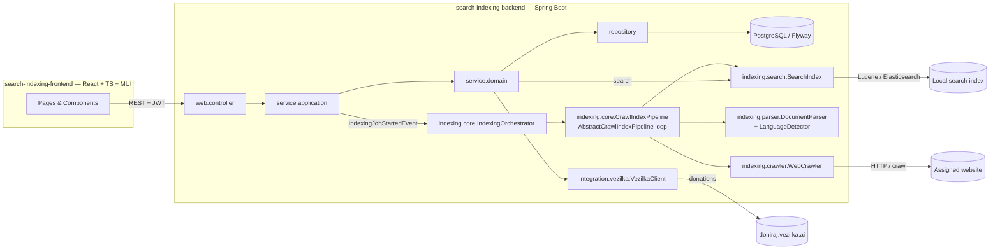

# Search Indexing Tool — Macedonian Web Content for doniraj.vezilka.ai

Template for the EMC course project: a **search indexing tool** that **crawls a
specific website of Macedonian-language resources**, **indexes** its content with
a local search engine (**Apache Lucene, Elasticsearch, or similar**), exposes
**full-text search** over it, and **donates** the harvested Macedonian content to
[doniraj.vezilka.ai](https://doniraj.vezilka.ai) — the platform for preserving
the Macedonian language.

Секој студент добива **една** веб-страница (избрана од студентот или доделена од
професорот) и го имплементира пребарувачот за неа, следејќи ја оваа заедничка
архитектура. Шаблонот се компајлира и се стартува веднаш — вашата задача е да ги
имплементирате местата означени со `TODO(student)`.

## Architecture

The project follows the course reference architecture (`emc-2026` / e-shop):
layered backend (`web` → `service.application` → `service.domain` → `repository`),
record DTOs with `from()`/`to*()` mapping, Flyway-owned schema, stateless JWT
security, and a React + MUI frontend with the api/contexts/providers/hooks
structure.



### The crawl-index loop

`AbstractCrawlIndexPipeline.execute(...)` is a **final template method** — the
generic frontier loop is already written:

1. **Fetch** — `WebCrawler.fetch(url)` downloads the next URL from the frontier.
2. **Parse** — `DocumentParser.parse(page)` turns the page into a
   `ParsedDocument` (title, text, discovered links, media).
3. **Detect** — `LanguageDetector.macedonianConfidence(text)` annotates the
   document with a Macedonian-language confidence.
4. **Index** — the document is added to the `SearchIndex`, and the discovered
   links that pass `shouldFollow(...)` are enqueued.
5. Every step is reported through `CrawlStepListener` and persisted as a
   `CrawlActionLog`, so the frontend can show a live trace. The run is bounded by
   `crawler.max-pages-per-job` and paced by `crawler.request-delay-ms`.

Full-text search (`GET /api/documents/search`) queries the same `SearchIndex`.

You implement the **seams**, not the loop.

## Getting started

Prerequisites: Java 21, Node 20+, Docker.

```bash
# 1. Database
cd search-indexing-backend
docker compose up -d

# 2. Backend  (http://localhost:8080, Swagger at /swagger-ui/index.html)
./mvnw spring-boot:run

# 3. Frontend (http://localhost:3000)
cd ../search-indexing-frontend
npm install
npm run dev
```

Register and log in — auth is fully working. Every endpoint of the indexing
domain returns **HTTP 501 Not Implemented** with the name of the `TODO(student)`
method that is missing; as you implement them, the 501s disappear one by one.

Tests: `./mvnw test` (Docker must be running — Testcontainers starts a real
PostgreSQL). `UserRepositoryTest` is a working example of the expected test
pattern; the `@Disabled` skeletons are yours to implement.

## What you implement — `TODO(student)` milestones

Search the codebase for `TODO(student)` — every marker is part of the
assignment. Grouped by milestone:

| # | Milestone | Where |
|---|-----------|-------|
| 1 | **Web crawler** — fetch a URL from your site (add JSoup / Java HttpClient / crawler4j / Playwright yourself) | `indexing/crawler/StubWebCrawler` → your implementation |
| 2 | **Document parser** — HTML → title, clean text, discovered links, media | `indexing/parser/StubDocumentParser` |
| 3 | **Language detection** — Macedonian-language confidence | `indexing/parser/StubLanguageDetector` |
| 4 | **Search index** — implement the Lucene / Elasticsearch / similar seam (add the dependency yourself) | `indexing/search/StubSearchIndex` |
| 5 | **Your site's pipeline** — the crawl frontier hooks: `docIdFor`, `shouldFollow` (and optionally `normalizeUrl`) | `indexing/core/StubCrawlIndexPipeline` → e.g. `MkdMkPipeline extends AbstractCrawlIndexPipeline` |
| 6 | **Orchestration** — run a whole job, persist documents and logs, finish/fail the job | `indexing/core/IndexingOrchestratorImpl` |
| 7 | **Domain & application services** — jobs, documents (paged + filtered + **search**), donations | `service/domain/impl/*`, `service/application/impl/*` |
| 8 | **Vezilka integration** — submit donations, poll their status | `integration/vezilka/StubVezilkaClient`, `DonationService.submit/refreshSubmittedStatuses` |
| 9 | **Frontend features** — job form & live log viewer, **search UI**, document browser with filters, donation workflow | `hooks/useJobDetails,useDocuments,useSearch,useDonations`, `ui/components/job|document|search|donation/*`, pages |
| 10 | **Tests** — repository + integration + search-index tests following the provided pattern | `src/test/java/...` (`@Disabled` skeletons) |

Fully provided (do **not** reimplement): JWT auth (backend + frontend), the
crawl-index loop (`AbstractCrawlIndexPipeline`), `CrawlActionLogService`, Flyway
migrations V1–V5, the controllers, exception handlers, and the jobs provider on
the frontend (the reference example of the provider pattern).

## Rules

1. **Do not break the layering.** Controllers speak DTOs and call only
   `service.application` interfaces; application services map DTO↔entity and
   call `service.domain` interfaces; domain services speak entities and call
   repositories (and the `SearchIndex`/`VezilkaClient` seams). The indexing
   layers never touch repositories — persistence goes through the orchestrator's
   services.
2. **Do not change the shared abstractions** (`WebCrawler`, `DocumentParser`,
   `LanguageDetector`, `SearchIndex`, `CrawlIndexPipeline`, `VezilkaClient`) or
   the crawl-index loop. Extend, don't edit. New migrations go in new Flyway
   versions (`V6__...`), never in edits to V1–V5.
3. **Keep the conventions**: record DTOs with `from()`/`to*()` (no mapper
   libraries), constructor injection, per-controller exception handlers;
   frontend one-folder-per-component, contexts/providers/hooks triads,
   default exports for components and named exports for types.
4. **Secrets stay out of git**: any crawl credentials, the search-cluster
   connection, LLM/API keys and the Vezilka API key belong in `.env` /
   environment variables.

## Responsible use

The tool exists to help preserve the Macedonian language. Crawl only publicly
accessible content, **respect the target site's `robots.txt` and rate limits**
(the loop's `crawler.max-pages-per-job` bound, `crawler.request-delay-ms` delay
and `crawler.user-agent` exist for a reason), don't collect private or sensitive
personal data, and keep the source URL of everything you index and donate —
provenance matters for the corpus.

## Project layout

```
search-indexing-tool-template/
├── search-indexing-backend/     Spring Boot 3.4 / Java 21 / Maven / PostgreSQL + Flyway
│   └── src/main/java/mk/ukim/finki/searchindexing/
│       ├── indexing/       crawler | parser | search | core   ← the search-indexing seams
│       ├── integration/vezilka/                                 ← doniraj.vezilka.ai client
│       ├── model/          domain | dto | enums | exception
│       ├── repository/  service/domain/  service/application/
│       ├── web/            controller | dto | filter | handler
│       ├── config/  constants/  events/  helpers/  jobs/  listener/
│       └── ...
└── search-indexing-frontend/    React 19 / TypeScript / Vite / MUI
    └── src/
        ├── axios/  api/ (+ api/types/)
        ├── contexts/  providers/  hooks/
        └── ui/  pages | components  (one folder per component)
```
